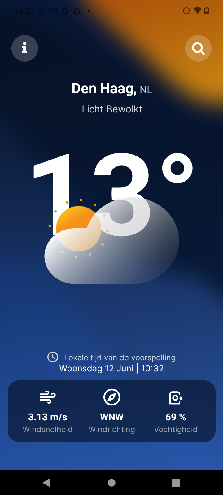
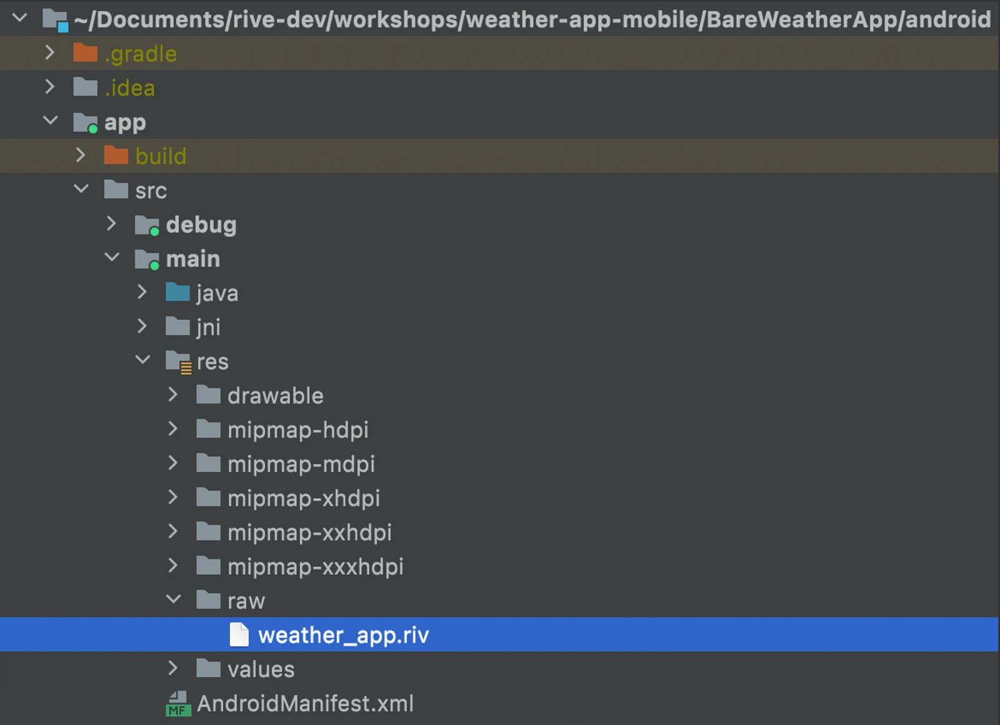

<h1 align="center">
  <br/>
Gabe Weather </h1>


## Requirements

- [React Native dev environment ](https://reactnative.dev/docs/environment-setup)
- [Node.js LTS release](https://nodejs.org/en/)
- [Git](https://git-scm.com/)
- [Watchman](https://facebook.github.io/watchman/docs/install#buildinstall), required only for macOS or Linux users
- [Pnpm](https://pnpm.io/installation)

## 👋 Quick start

Clone the repo to your machine and install deps :

```sh
git clone https://github.com/Gabe-Vince/gabe-weather.git

cd "/path-of-repo"

pnpm install
```

Before diving into the code, there are a few essential steps you need to follow to ensure everything is set up correctly. The project uses native modules and assets that need to be loaded into the native assets folder. To do this, you'll need to run the following command:

```sh
pnpm prebuild
```

This command prepares the project by running the necessary pre-build steps. Make sure to run it before starting any development work to avoid any issues with native modules or assets.

To run the app on ios

```sh
pnpm ios
```

To run the app on Android

```sh
pnpm android
```

## Troubleshooting

I am using Rive for my animation weather icons that change dynamically according to the weather. Rive is built for fast and performant real-time animation. There are, however, steps you need to take if the Rive file is not working. The .riv file is located in './assets/animations/gabeweather.riv'

### Adding to iOS

In the `ios/` folder of your React Native project, open the `.xcodeproj` file in XCode. This will open up the native iOS project.

1. Create a New Group under the root of this project and name it whatever asset folder name you'd like to give it (i.e., Assets).
2. Drop your `.riv` file into this group, and when prompted by XCode, add it to the Target of your app. This ensures that the Rive file gets included in the bundle resources.


### Adding to Android

In the `android/` folder of your React Native project, open the whole folder in Android Studio. This will open up the Android project.

1. Under the `/app/src/main/res/` directory, create a new Android Resource Directory, which is where you'll store Rive file assets.
2. When prompted to select a name for the folder and resource type, select `raw` from the resource type dropdown.
3. Drop your `.riv` file into this new folder; this ensures that the Rive file gets included in the bundle resources.



Once the Rive files are added to the asset/resource bundles of the iOS and Android projects in the React Native app, the `resourceName` prop located in `src/components/animated-weather-icon.tsx` should work.

### Using expo-custom-assets Plugin

I have installed a plugin from the community that adds the `.riv` file to the relevant native folder called `expo-custom-assets`. It worked for my build on Android. Here is the link for the Android build if you want to download it directly: [Gabe Weather Android Build](https://expo.dev/accounts/vimbatech/projects/gabe-weather/builds/311caa8d-6ad3-467a-b0db-89f096929ce8) - this already has the `.riv` file inside the native asset folder and you will just have to run:

```sh
pnpm start
```

to start up the dev client

Unfortunately, I could not make a build for iOS as I am having major headaches about my Apple Developer Program account, and Apple support has been a nightmare. I know this might be a painful setup process, but the pros of using Rive and its lightweight, performant use, and user experience definitely outweigh the cons.

## Project Structure

### Folders and Files Explained

- **api**: This folder contains everything related to API calls, setting up our Query provider and data fetching, specifically from open weather api.

  - **common**: Sets up our query and axios client
  - **forecast**: Queries and types related to current forecast fetching
  - **geocoding**: Contains the calls related to the fetching of cities
  - **types.ts**: Type definitions related to API data structures.

- **core**: This folder holds the core files for the application, such as state management, translation set up and utility functions used in the app.

  - **store**: Manages our global state store using zustand
  - **env.js**: Handles client environment variables, ensuring secure and consistent configuration.
  - **storage**: Handles set up and functions relating to local storage
  - **keyboard**: Configuration for avoid soft keyboard input
  - **utils**: Utility functions for parts of the app
  - **i18n**: Configuration of i18 for translations throughout the app

- **components**: This folder includes all feature related components.

  - **forecast-card**: A component that deals with displaying wind and humidity information.
  - **search**: Contains all components related to the search feature, allowing users to search for cities and weather information.
  - **forecast-main**: Components that handle Rive animations, displaying local time, and city-specific weather data.
  - **settings**: Components that are used on the settings page

- **translations**: Translation json's that are used for English and Dutch translations

- **ui**: Reusable UI components and style configurations

- **app**: The base of navigation and file-based routing for the application. This is where the main navigation structure is defined.
  - **layout**: Defines the stack, routing and set up of the providers
  - **index**: Home page of the app
  - **settings**: Details of the app including ability to change language

By organizing the project in this way, we ensure a clear separation of concerns, making the codebase more maintainable and scalable. Each folder and file has a specific purpose, contributing to the overall functionality of the application.

## Tech Used

Here's a rundown of the key technologies and libraries used in this project:

### NativeWind

NativeWind was used to speed up the development process by allowing us to code styles faster without worrying about StyleSheets. It provides a utility-first CSS framework for React Native, making it easier to apply styles directly within the components.

### Expo Router

Expo Router was chosen for navigation because it offers a smooth developer experience and enhances the performance of the app. I believe it represents the future of React Native navigation with its file-based routing approach.

### Reanimated

Reanimated was used for animations in the app. Although adding animations can sometimes make the code look a bit messy, Reanimated is a powerful tool that provides smooth and performant animations.

### Rive

Rive was utilized for interactive icons. The ability to add lightweight animation files to a React Native runtime is mind-blowing. The control over the state machine of animations makes Rive essential for delivering great user experiences.

### i18n

i18n was used for translations, allowing users to view the weather in Dutch. Given that we live in the Netherlands, it was important to make the app accessible in the local language, making i18n an obvious choice.

### Axios and React Query

Axios and React Query were used for data fetching. These tools provide easy control over the caching behavior of the app, making API requests less intensive and improving app performance. When you start the app with `pnpm start`, press `shift + m` to access a dev-plugin/react-query interface where you can view the caching behavior in action, which is super cool and helpful.

### MMKV

MMKV was used for local storage, primarily to store the user's selected language on their device for easy access. It's a high-performance key-value storage library for React Native.

### Additional Libraries

This overview covers some of the main tools and technologies used in the project, but there are many other important libraries that play an integral role in the app. If you have any questions or want to know more about them, please feel free to reach out!

---

I hope this gives you a clear picture of the technologies and libraries used in the project. Feel free to reach out if you have any questions or need more information.
